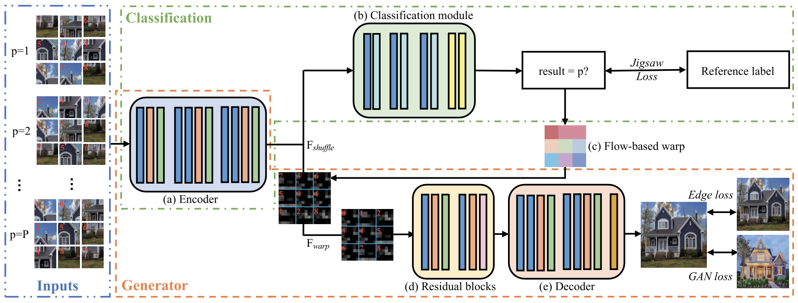
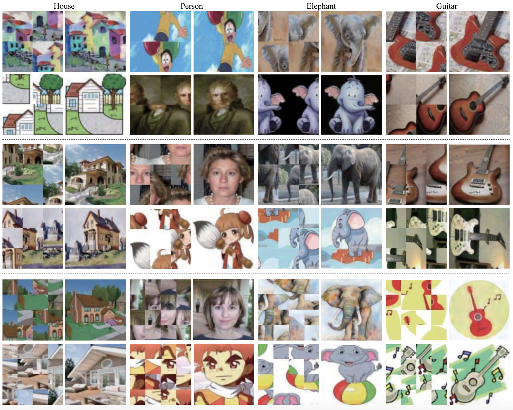

## JigsawGAN: Auxiliary Learning for Solving Jigsaw Puzzles With Generative Adversarial Networks

This is the Pytorch implementation of our TIP 2021 paper [JigsawGAN](https://liru0126.github.io/collections/2021_tip/tip2021.pdf).



## Dependencies

* Python
* Pytorch
* Other requirements please refer to requirements.txt.

## Results




## Citation

```
@article{li2021jigsawgan,
  title={Jigsawgan: Auxiliary learning for solving jigsaw puzzles with generative adversarial networks},
  author={Li, Ru and Liu, Shuaicheng and Wang, Guangfu and Liu, Guanghui and Zeng, Bing},
  journal={IEEE Transactions on Image Processing},
  volume={31},
  pages={513--524},
  year={2021}
}
```
